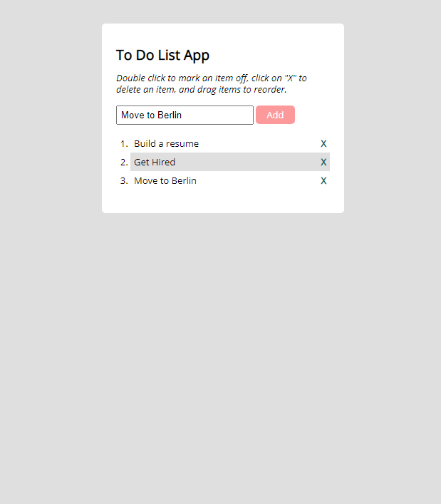

## To-do-list-app
A simple javascript app that allows the user to create a to-do list, with the ability to check off completed tasks via a line-through or to remove them altogether

## Screenshots

## Technologies Used
* Javascript
* HTML
* jQuery